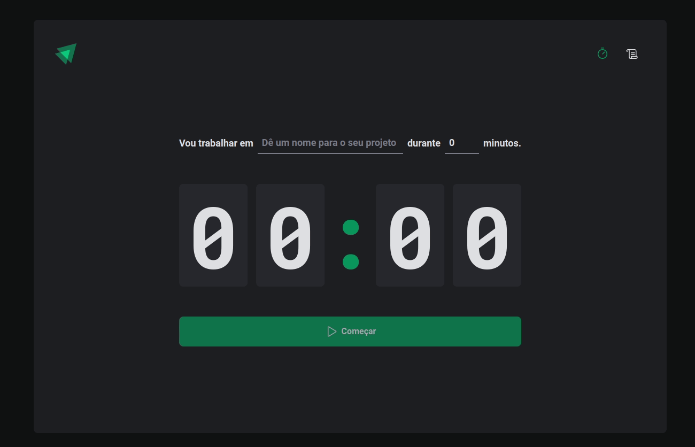

<div align="center" id="top"> 
  

&#xa0;

  <!-- <a href="https://ignitetimer.netlify.app">Demo</a> -->
</div>

<h1 align="center">Ignite Timer</h1>

<p align="center">
  

  

  

   
</p>

<p align="center">
  <a href="#dart-about">About</a> &#xa0; | &#xa0; 
  <a href="#sparkles-features">Features</a> &#xa0; | &#xa0;
  <a href="#rocket-technologies">Technologies</a> &#xa0; | &#xa0;
  <a href="#white_check_mark-requirements">Requirements</a> &#xa0; | &#xa0;
  <a href="#checkered_flag-starting">Starting</a> &#xa0; | &#xa0;
  <a href="#memo-license">License</a> &#xa0; | &#xa0;
  <a href="https://github.com/wsasouza" target="_blank">Author</a>
</p>

<br>

## :dart: About

Aplicação inspirada no método pomodoro para gerenciamento de tempo de concentração e foco em tarefas e períodos de descanso.

<h4>O que é a técnica Pomodoro?</h4>

Foi desenvolvida no final dos anos 80 pelo italiano Francesco Cirillo, que procurava uma maneira de aumentar sua produtividade nos estudos durante os primeiros anos de universidade. Para isso, ele utilizou um timer de cozinha para organizar suas tarefas.

Assim, seu timer tinha o formato de um tomate (pomodoro, em italiano) e girava durante 25 minutos, emitindo um barulho forte ao final desse prazo. Nesse meio tempo, Cirillo se concentrava nas suas tarefas sem interrupções (mesmo!), mantendo-se 100% focado. Ao perceber os resultados satisfatórios, divulgou sua técnica em 1992.

**Trata-se de uma ferramenta simples e eficaz para que você gerencie o seu tempo.**

<h4>Como funciona o Pomodoro?</h4>

A técnica se baseia na ideia de que dividindo o nosso fluxo de trabalho em blocos de concentração intensa, conseguimos melhorar a agilidade do cérebro e estimular nosso foco. Em outras palavras, melhoramos nossa gestão do tempo e ficamos mais eficientes. Portanto, para colocá-la em prática você vai precisar de:

- Timer ou cronômetro para fazer contagem regressiva
- Uma lista de tarefas (“to-do-list”)

Primeiramente, você deve fazer uma lista de tarefas a serem desempenhadas durante o dia. Depois, basta dividir seu tempo em períodos de até 1h (recomendado é 25 minutos)(chamados “pomodoros”) e trabalhar ininterruptamente em suas tarefas nesses períodos.

A cada quatro ciclos, faça uma pausa maior (entre 15 e 30 minutos) para descansar. Esses intervalos entres os pomodoros são fundamentais para “oxigenar o seu cérebro” e aumentar a agilidade mental.

## :sparkles: Features

:heavy_check_mark: Timer ajustável múltiplos de 5 até 60 minutos 1;\
:heavy_check_mark: Botão Start / Stop;\
:heavy_check_mark: Histórico das tarefas executadas;\
:heavy_check_mark: Histórico salvo no local storage;

## :rocket: Technologies

The following tools were used in this project:

- [React](https://pt-br.reactjs.org/)
- [TypeScript](https://www.typescriptlang.org/)

## :white_check_mark: Requirements

Before starting :checkered_flag:, you need to have [Git](https://git-scm.com) and [Node](https://nodejs.org/en/) installed.

## :checkered_flag: Starting

```bash
# Clone this project
$ git clone https://github.com/wsasouza/ignite-timer

# Access
$ cd ignite-timer

# Install dependencies
$ yarn

# Run the project
$ yarn dev

# The server will initialize in the <http://localhost:3000>
```

## :memo: License

This project is under license from MIT. For more details, see the [LICENSE](LICENSE.md) file.

Made with :heart: by <a href="https://github.com/wsasouza" target="_blank">Walter Santos de Andrade Souza</a>

&#xa0;

<a href="#top">Back to top</a>
